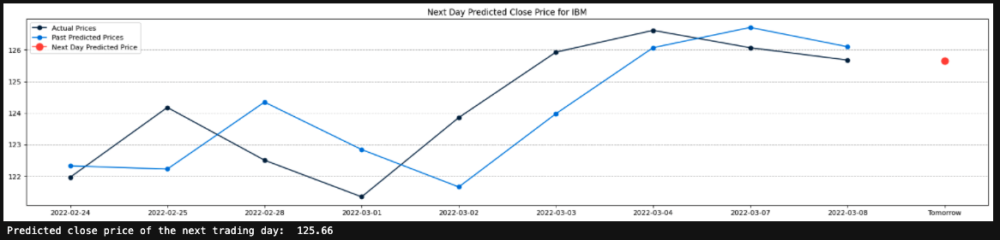

# **[Predicting Stock Prices with Deep Neural Networks](https://www.alphavantage.co/academy/#ai-for-finance)**
---

# March 2022 IBM 
---
### Original Data

### Training vs. Validation Data

### LSTM Model: Predicted Prices to Actual 

### Zoomed-In LSTM Model 

### Predicting Future Prices 4

# Long Short-Term Memory [(LSTM)](https://www.geeksforgeeks.org/long-short-term-memory-networks-explanation/)
---
- Deep Learning Framework
- Variant of Deep Recurrent Neural Network (RNN)
- Avoids Vanishing Gradient Problem
    - *[Vanishing Gradient Problem:](https://towardsdatascience.com/the-vanishing-gradient-problem-69bf08b15484)* 
        - Issue that sometimes arises when training ML algorithms through gradient descent 
        - Common in neural networks with many layers such as in deep learning
        - Calculated partial derivatives used to compute the gradient get too small
            - Derivatives: change of a function for a given input 
            - Gradient: derivative of a function with multiple input variables (vector) 
            - Gradients small or zero than little to no training of the model can take place 
        - Grdients of the neural network found via *backpropagation*
            - finding derivatives of network moving backwards layer by layer 
    - *[Gradient Descent:](https://www.ibm.com/cloud/learn/gradient-descent) Optimization Technique*
        - minimize the error between predicted and actual (cost function)
            - two data points: direction and learning rate
            - Learning Rate: step size or alpha -> steps taken to reach the minimum 
                - feature values in the model affect step size and skew the LSTM model
            - Direction: Cost Function -> error between actual vs. predicted 
        - requires data to be scaled for LTSM
        - 3 types: Batch, Stochastic, and Mini-Batch 
- Feedback connections to process single data points as well as sequences of data
    - Good at classifying, processing, and making predictions from time-series data 
- Tries to 'remember' all past knowledge from the network and 'forget' irrelevant data 
    - Introducing function layers called **gates**:
        - Forget Gate: what previous data to forget
        - Input Gate: what information to be written onto Internal Cell State 
        - Input Modulation Gate: modulate the information written onto the Internal Cell State
            - make information *non-linear* and *zero-mean*
            - reducing the learning time as the *zero-mean* converges 
        - Output Gate: what output (hidden state) to generate from the current Internal Cell State 
- Similar to workflow of a Recurrent Neural Network, but the Internal Cell State and gate unit is also passed forward with the Hidden State 

# [Data Normaliztion]()
---
- Manipulate, scale down, or scale up the range of data
- Remodeling numbers to a standard scale to reduce variance 
- Helps gradient descent algorithm converge more quickly -> less intermediary computations
- LSTM sensitive to data scale -> easier and faster to handle upfront 
- Z-Score Normalization: 
    - Z-Score -> measures variability and often used to help traders determine market volatility 
    - Is the score a typical value or is it far off? 
    
    
# [Loss Function:](https://towardsdatascience.com/understanding-the-3-most-common-loss-functions-for-machine-learning-regression-23e0ef3e14d3) 
- `loss train`: how well our model is learning
- `loss test`: how well our model generalizes to the validation dataset 
- Well trained models will have training and validation loss that decreases to neglibible differences between the two values 
- loss values usually lower on training than validation datasets 

#### Mean Squared Error (MSE):
- MSE will never be negative (always squaring errors)
- Pro: Ensuring training model has no outliers with large errors 
- Con: Model makes a wrong prediction the error is magnified due to the squaring 

#### Mean Absolute Error (MAE):
- MAE will never be negative (taking absolute value of errors)
- Pro: Errors weighted on same linear scale -> less weight on outliers 
- Con: Less emphasis on outliers if that is the intended goal 

#### Huber Loss: 
- loss values < delta, use the MSE
- loss values > delta, use the MAE 
- Magnifies loss values as long as they are greater than 1
- Focuses training n higher-error data points
